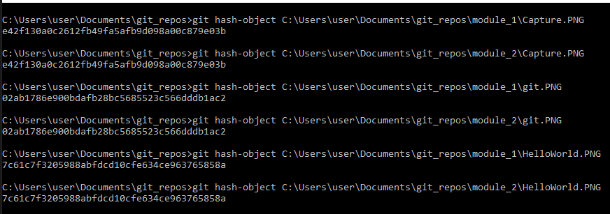

Vienādu failu hash abās mapēs ir vienādi:

Informācijas par izmaiņām iegūšana terraform projektā:

16. Pārbaudīt kādas izmaiņas tika veiktas iepriekšējās nedēļas laikā. Atrast vismaz divus veidus kā to izdarīt:

git log --since="2022-04-18" --until="2022-04-24"

git log --since=1.weeks

17. Atrast commit kurus veica autors - “Laura Pacilio”:

git log --author="Laura Pacilio"

18. Atrast vai Laura ir veikusi commit pagājušā gada septembrī:

git log --author="Laura Pacilio" --since="2021-09-01" --until="2021-09-30"

19. Vai Laura ir veikusi commit vakar:

git log --author="Laura Pacilio" --since="2022-04-25 00:00" --until="2022-04-26 00:00"